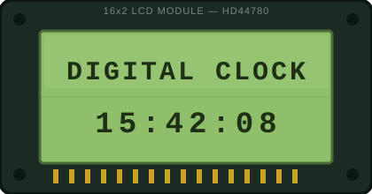

# Digital Clock using 8051

A real-time digital clock built on the **8051 microcontroller**, interfaced with a **DS1307 RTC** over I²C and a **16×2 character LCD** for display. The DS1307 maintains timekeeping independently in hardware; the 8051 polls its registers, converts the BCD-encoded values to decimal/ASCII, and refreshes the LCD — a standard architecture for RTC-backed embedded timekeeping where the microcontroller is a display/control layer rather than the time source itself.

<p align="center">
  
</p>

## System Overview

| Parameter | Value |
|---|---|
| MCU | 8051 (8-bit, AT89C51 or equivalent) |
| Oscillator | 12 MHz crystal |
| Machine cycle | 1 µs (12 clock periods per cycle @ 12 MHz) |
| RTC | DS1307 (I²C, BCD register format) |
| RTC oscillator | 32.768 kHz crystal |
| Display | 16×2 character LCD (HD44780-compatible) |
| RTC interface | I²C (software bit-banged, SDA/SCL) |
| Data format | BCD → ASCII |
| Firmware | Embedded C (Keil C51) |
| Simulation | Proteus Design Suite |

**Note on timing:** with a 12 MHz crystal, the 8051's machine cycle is 1 µs, since one machine cycle = 12 oscillator periods. This is the reference used for all software delay loop calculations in `delay.c` (I²C bit timing, LCD enable pulse width, and initialization delays).

## Features

- Real-time clock backed by the DS1307, independent of MCU reset/power cycling (battery-backed)
- Software I²C master implementation for RTC register access (no on-chip I²C peripheral on standard 8051)
- BCD-to-decimal/ASCII conversion pipeline for direct LCD output
- Modular driver architecture — I²C, RTC, LCD, and delay layers are independently testable and reusable
- Verified in Proteus prior to physical hardware bring-up, catching timing/logic issues in simulation first

## Hardware

| Component | Function |
|---|---|
| 8051 Microcontroller | Main controller, runs application + I²C master + LCD driver logic |
| 12 MHz crystal + 2×33 pF capacitors | MCU clock source |
| DS1307 RTC | I²C real-time clock/calendar IC |
| 32.768 kHz crystal | DS1307 timebase |
| 16×2 LCD | Time display (4-bit or 8-bit parallel mode) |
| 3V backup cell (e.g. CR2032) | Keeps DS1307 running on main power loss |
| 4.7 kΩ pull-ups ×2 | Required on I²C SDA/SCL (open-drain lines) |
| 10 µF + 33 pF decoupling | Power supply and oscillator stabilization |
| 5V regulated supply | Logic power rail |

*Exact pin mapping and passive values are documented in the Proteus schematic (`8051 RTC.pdsprj`).*

## Firmware Architecture

```
main.c        → Application layer: init sequence, RTC polling, formatting, LCD refresh
i2c.c / .h    → Software I²C master: START/STOP, byte TX/RX, ACK/NACK, clock generation
ds1307.c / .h → RTC register map, read/write ops, BCD accessor functions
lcd.c / .h    → LCD init, command/data write, cursor control, string output
delay.c / .h  → Calibrated software delays (based on 12 MHz / 1 µs machine cycle)
```

**Execution flow:** Init LCD → Init I²C bus → Read DS1307 (seconds, minutes, hours registers) → Convert BCD nibbles to ASCII digits → Write formatted `HH:MM:SS` string to LCD → Delay → Repeat.

**I²C transaction (RTC read):** `START → Slave Address+W → ACK → Register Pointer → ACK → Repeated START → Slave Address+R → Data Bytes (ACK/NACK) → STOP`

## DS1307 Register Map (Used Registers)

| Register | Address | Content |
|---|---|---|
| Seconds | `0x00` | BCD seconds (bit 7 = clock halt) |
| Minutes | `0x01` | BCD minutes |
| Hours | `0x02` | BCD hours (12/24-hr mode via bit 6) |
| Day | `0x03` | Day of week |
| Date | `0x04` | Day of month |
| Month | `0x05` | Month |
| Year | `0x06` | Year (00–99) |

BCD values are unpacked by nibble (e.g. `0x25` → upper nibble `2`, lower nibble `5` → displayed as `"25"`), since the DS1307 stores time fields as packed BCD rather than raw binary.

## Project Structure

```
Digital-Clock-using-8051/
├── README.md
├── 8051 RTC.pdsprj        # Proteus simulation
├── 8051 RTC.png           # Schematic reference image
├── Keil-Project/
│   ├── Digital_Clock.uvproj
│   ├── STARTUP.A51
│   ├── main.c
│   ├── delay.c / delay.h
│   ├── i2c.c / i2c.h
│   ├── ds1307.c / ds1307.h
│   └── lcd.c / lcd.h
└── Project Backups/
    └── Proteus project backups
```

Build artifacts (`.hex`, `.obj`, `.lst`) are excluded from version control unless intentionally published as release binaries.

## Build & Simulate

1. **Clone:** `git clone https://github.com/raju-gudala/Digital-Clock-using-8051.git`
2. **Build firmware:** Open `Keil-Project/Digital_Clock.uvproj` in Keil µVision, confirm the target crystal frequency is set to **12 MHz** under target options, and build (`F7`) to generate the HEX file.
3. **Simulate:** Open `8051 RTC.pdsprj` in Proteus, load the generated HEX into the 8051 model, and run.
4. **Verify:** LCD should display live `HH:MM:SS`, incrementing in sync with the DS1307 model's seconds register.

## Design Notes

- Since the standard 8051 has no hardware I²C peripheral, the DS1307 interface is implemented as software (bit-banged) I²C — SDA/SCL are driven directly via GPIO with timing controlled by calibrated delay loops referenced to the 12 MHz clock.
- The DS1307's onboard oscillator and backup battery decouple timekeeping accuracy from MCU resets, brownouts, or firmware bugs — a meaningful reliability advantage over software-only (Timer-interrupt-based) clock implementations.
- Delay routines are clock-frequency-dependent; changing the crystal from 12 MHz requires recalculating all timing constants in `delay.c`.

## Roadmap

- [ ] Date/calendar display (`DD-MM-YYYY`) using existing DS1307 registers
- [ ] 12/24-hour display toggle
- [ ] Push-button time/date configuration interface
- [ ] Alarm subsystem with buzzer output
- [ ] EEPROM-backed configuration persistence (display mode, alarm settings)

## Tools

- **Keil µVision / C51** — firmware development, compilation, and debugging
- **Proteus Design Suite** — schematic capture and pre-hardware simulation
- **Git / GitHub** — version control and documentation


<p align="center">
  
  
  
  
  
</p>


## Author

**Raju Gudala**
Embedded Hardware Engineer | PCB Design | Firmware Development

---

**Status:** Functional 8051 + DS1307 RTC clock, verified in simulation. Actively being extended toward a more complete embedded timekeeping module.
